# Tarea3
### Pregunta 1: A partir de los datos, encontrar la mejor curva de ajuste (modelo probabilístico) para las funciones de densidad marginales de X y Y.

Primeramente se importan los datos mediante la libreria pandas. Posteriormente se procede a crear las listas x,y,Px,Py. Donde la lista "x" contiene todos los valores de esta variable, lo mismo para la "y". Donde además la lista Px contiene la densidad marginal de cada "x", y la lista Py la densidad marginal de cada "y". Cabe mencionar que para obtener la densidad marginal en "x" se sumaron todos los elementos de manera horizontal. Para obtener la densidad marginal en "y" se  se sumaron todos los elementos de manera vertical.Una vez que se llenaron las lista x,y,Px y Py se procede a gráficar para observar su comportamiento. 

Las gráficas de la distribución en  "X" y "Y" son respectivamente:

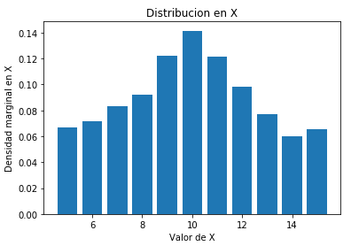 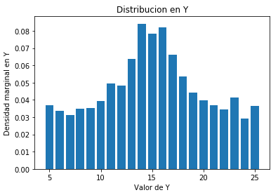

Observando las curvas se sabe que tiene que ajustarse a una curva gaussiana. Por lo que se calculan los parámetros y se obtiene un valor de mu=9.90484381 y sigma= 3.29944287 para la curva de mejor ajuste de acuerdo a la distribución en "X". Se obtiene un valor de mu=15.0794609 y sigma=6.02693775 para la curva de mejor ajuste de acuerdo a la distribución en "Y". Ambos ajustes de curva se ven en la siguiente gráfica:

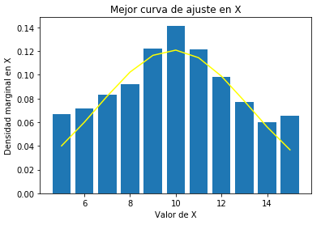 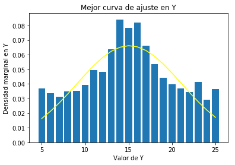

### Pregunta 2: Asumir independencia de X y Y. Analíticamente, ¿cuál es entonces la expresión de la función de densidad conjunta que modela los datos?

Se sabe que la función gaussiana se ve de la manera:

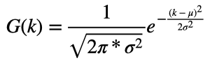 

Sustituyendo los parámetos obtenidos en la primera parte se tiene:

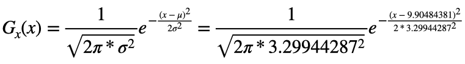 

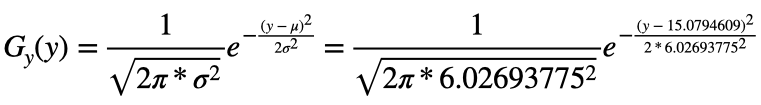

Asumiendo independencia de X y Y,  la expresión de la función de densidad conjunta que modela los datos quedaría:
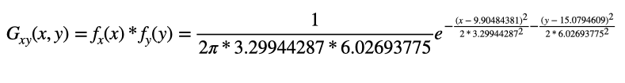 

### Pregunta 3: Hallar los valores de correlación, covarianza y coeficiente de correlación (Pearson) para los datos y explicar su significado.
Se sabe que para la correlación se tiene la fórmula:

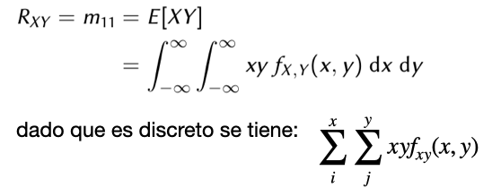 

En este caso debido a que es discreto, en vez de integral consiste en una suma de los valores X*Y*frecuenciarelativa, de modo que se calcula X5*Y5*0.00262+X6*Y5*0.00493+... así con todas las X para Y5 y luego se pasa a Y6 y así hasta terminar todas las columnas. Con el programa se obtiene una correlación de 149.54281.Como se sabe que la correlación es el grado en el cual dos o más cantidades están linealmente asociadas, o dicho de otra manera la correlación es una medida de la fuerza de la relación entre dos variables, este resultado obtenido de la correlación dado que es un número positivo grande significa que las variables están linealmente asociadas.

Se sabe que para la covarianza se tiene la fórmula:

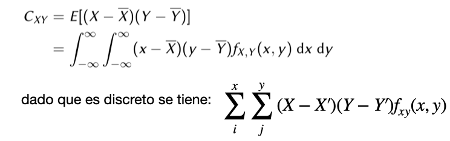 

Para obtener la covarianza se realiza lo mismo, con la diferencia que en vez de X seria (X - X´) al igual que con Y que seria (Y - Y'). Donde X' es la media del modelo, que en este caso es mu ya que se tiene una función gaussiana. Por ende de la primera parte se tiene que X´= 9.90484381 y Y'= 15.0794609. Con el programa se obtiene una covarianza de 0.06669157001171337. Esto indica la dispersión entre las dos variables, además de que como dá mayor que cero se sabe que poseen relación directa y que cuando una variable crece la otra variable también lo hace.

Del coeficiente se tiene la fórmula:

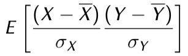 

De la fórmula anterior se sabe que para obtener el coeficiente de correlación se debe dividir la covarianza entre el sigma del modelo de X y el de Y. Por ende de la parte 1 se tiene que SigmaX= 3.29944287 y SigmaY= 6.02693775. Con el programa se obtiene un coeficiente de correlacion de 0.0033537726804049365. Ya que el coeficiente da mayor a cero esto significa que posee una asociación positiva, lo que quiere decir que conforme se va aumentando el valor de una variable, también lo esta realizando el valor de la otra.
### Pregunta 4: Graficar las funciones de densidad marginales (2D), la función de densidad conjunta (3D).

Con los datos obtenidos en la pregunta 1 se obtiene la función de densidades marginales (2D) dada por el modelo gaussiano para la distribución en X y en Y. Dichas gráficas son:

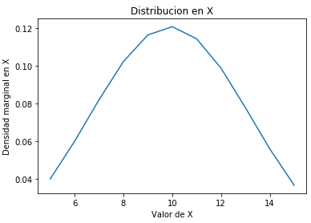 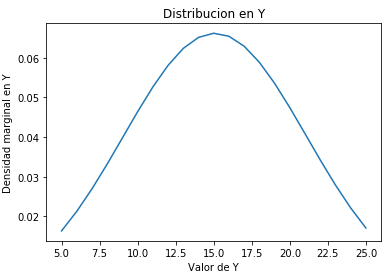

Para realizar la gráfica en 3D de la densidad conjunta, primeramente se utilizó la densidad conjunta obtenida en la pregunta 2, donde se realiza una matriz de coordenadas con "x" y "y". Importando la bliblioteca Axes3D y utilizando  plt.axes se obtiene la siguiente gráfica de densidad conjunta:

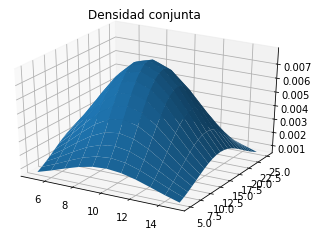
